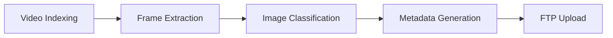
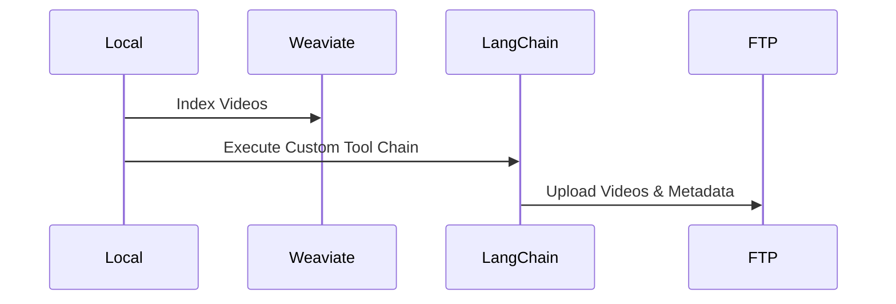

# Automated Stock Video Metadata Management System - Cdaprod 

## Overview

The Automated Stock Video Metadata Management System is a custom-built automation software designed to streamline the handling of metadata for stock video footage. By leveraging state-of-the-art technologies and cloud computing, this project successfully transformed a time-consuming manual process into an efficient, automated workflow.

## Key Features

### **1. Video Indexing and Frame Extraction**
   - **Indexing Videos:** Utilized Weaviate vectordb to index videos, allowing for semantic search over visual content.
   - **Frame Extraction:** Integrated OpenCV to extract and analyze frames from videos of various formats including mp4 and ProRes.

### **2. Image Classification and Metadata Generation**
   - **AI-driven Analysis:** Employed TensorFlow for image classification, enabling the system to generate precise descriptions and keywords for each video.
   - **Metadata Handling:** Created a database schema to manage video metadata, including BlackBox metadata fields, and populated it dynamically during the indexing process.

### **3. Dockerization and Deployment**
   - **Containerization:** Dockerized the entire project for seamless deployment across different environments.
   - **Scalability:** Ensured that the solution is scalable and can be utilized as a repeatable service.

### **4. Integration with BlackBoxGlobal FTP Server**
   - **Automated Upload:** Built functionality to automatically upload metadata and videos to the BlackBoxGlobal FTP server, following the necessary stock constraints.
   - **Metadata Compliance:** Implemented constraints to ensure that the metadata adheres to BlackBox's specifications, including generating a BlackBoxMetadata.xlsx file.

### **5. Custom Tools and Chains with LangChain**
   - **Custom Tool Development:** Utilized LangChain to develop custom tools and chains for various tasks, such as video enumeration, metadata database creation, and more.
   - **Logging and Monitoring:** Implemented robust logging mechanisms to track the entire workflow within the system.

## Technologies Used

- **Programming Language:** Python
- **Database:** MariaDB
- **AI/ML Libraries:** TensorFlow, OpenCV
- **Vector Database:** Weaviate
- **Automation Framework:** LangChain
- **Containerization:** Docker

## Impact

This project not only solved a personal challenge but also has the potential to be offered as a scalable service with passive income capabilities. It showcases a blend of technical expertise, innovation, and entrepreneurial spirit, highlighting the ability to develop custom automation software in the cloud.
