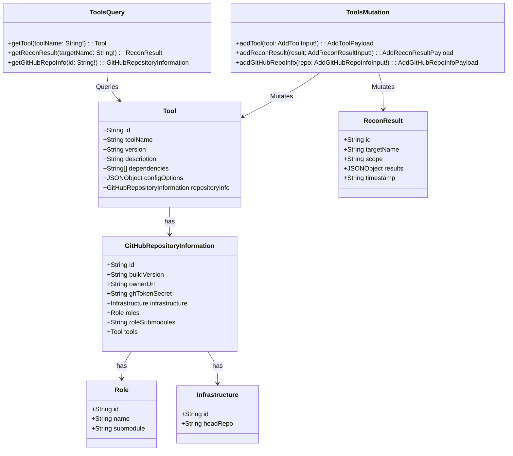
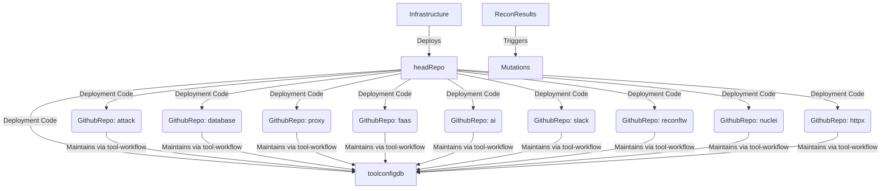

# Bug Bounty System Project
_A project by David Cannan/Cdaprod_

**Date:** June 24, 2023  
**Contact:** davidacannan@gmail.com

# Summary

## Interfacing with langchain via custom components

```mermaid
graph TD
    A[bug-bounty-hunting-ai]
    B[.github/workflows]
    C[ansible]
    D[docker]
    E[graphql]
    F[langchain]
    G[modal]
    H[gradio]
    I[infrastructure]
    J[parsers]
    K[results]
    L[tools]
    M[templates]
    N[deployment]
    O[main.py]
    P[requirements.txt]
    Q[README.md]
    
    A --> B
    A --> C
    A --> D
    A --> E
    A --> F
    A --> G
    A --> H
    A --> I
    A --> J
    A --> K
    A --> L
    A --> M
    A --> N
    A --> O
    A --> P
    A --> Q
    
    B --> Ba[actions.yml]
    
    C --> Ca[roles]
    C --> Cb[inventory]
    
    D --> Da[Dockerfile]
    
    E --> Ea[endpoints]
    
    F --> Fa[custom_tools]
    
    G --> Ga[clone.py]
    
    H --> Ha[chatbot.py]
    
    I --> Ia[builder.py]
    I --> Ib[schema.json]
    
    J --> Ja[parse_recon.py]
    
    K --> Ka[schema.graph]
    
    L --> La[deploy_ingress.py]
    L --> Lb[search.py]
    L --> Lc[tools.json]
    L --> Ld[tools_schema.graph]
    
    M --> Ma[prompts.j2]
    
    N --> Na[manager.py]
```

Diagram of Tooling and Configuration

This project aims to create a robust system for automating bug bounty tasks, streamlining the process, and increasing effectiveness and productivity. This system leverages AI, serverless functions, and an extensive set of tools, providing a robust and automated workflow for bug bounty hunters. This system is called the "Bug Bounty System" (BBS).

The backbone of the BBS is a GraphQL server powered by Dgraph, providing a flexible API to interact with the data related to bug bounty tasks. The Dgraph GraphQL server is used to manage, store, and retrieve data about the tools used in the bug bounty process, the results from running reconnaissance tools, and the details of the GitHub repositories that house these tools.

The primary entities managed in the BBS are `Tool`, `ReconResult`, `GitHubRepositoryInformation`, and related entities such as `Role` and `Infrastructure`. 

A `Tool` represents a software tool used in the bug bounty process. Each tool has a name, a version, a description, a set of dependencies, configuration options, and a link to a GitHub repository where the tool's code resides. 

`ReconResult` represents the results from running a reconnaissance tool on a specific target. Each result has a target name, scope, a JSON object storing the results, and a timestamp.

`GitHubRepositoryInformation` represents the details of a GitHub repository linked to a tool or a role. Each GitHub repository has a build version, an owner URL, a GitHub token secret, a link to the infrastructure details, a list of roles, and a list of role submodules. 

`Role` and `Infrastructure` are additional entities that provide more context and organization for the tools and repositories. 

We utilize the power of Python and Jupyter notebooks to interact with the Dgraph GraphQL server, load initial data, and define and execute GraphQL queries and mutations. The Jupyter notebooks serve as the platform for developing, documenting, and executing the code related to the BBS.

In addition to defining the GraphQL schema and executing GraphQL operations, we discussed writing Python functions for performing complex tasks such as installing tools from GitHub repositories, processing reconnaissance results, and populating the Dgraph database with data from JSON files.

Given the complexity and the number of different types and fields involved, we applied the DRY principle (Don't Repeat Yourself) to the GraphQL schema by introducing the `Entity` and `NamedEntity` interfaces. These interfaces represent common fields shared by the entities in the BBS, providing a more efficient and less redundant schema.

After the BBS's backbone has been established, the next steps include creating serverless functions to handle dynamic tasks such as tool installation and data processing. We also discussed the importance of data wrangling and developing an automated and repeatable workflow for bug bounty tasks.

The infrastructure for the BBS is defined and maintained in a GitHub repository (headRepo), which deploys multiple roles repositories (RoleRepos). These RoleRepos contain the code for different roles such as attack, database, proxy, and others. Each RoleRepo maintains the tool configuration database (`toolconfigdb`) through a tool-workflow mechanism. 

This entire system ensures a streamlined and automated process for bug bounty hunters, allowing them to focus more on hunting and less on managing their tools and workflows. 

The system is designed to handle multiple mutations and resolvers, allowing for flexible and robust interactions with the data stored in the database. 

## Class Diagram

 

 
## References 

Dgraph: https://dgraph.io/

GraphQL: https://graphql.org/

Python: https://www.python.org/

Jupyter Notebooks: https://jupyter.org/

GitHub: https://github.com/

Mermaid for Diagrams: https://mermaid-js.github.io/

## Credits

OpenAI for providing the GPT-4 model and OpenAI API, which assisted in the ideation and development of the BBS.

---

This concludes the summary of our

 discussion on developing a system for automating bug bounty tasks using AI, serverless functions, and an extensive tool set. The Bug Bounty System represents a significant step forward in the field of bug bounty hunting, providing a robust, automated, and efficient system for managing bug bounty tasks and tools.